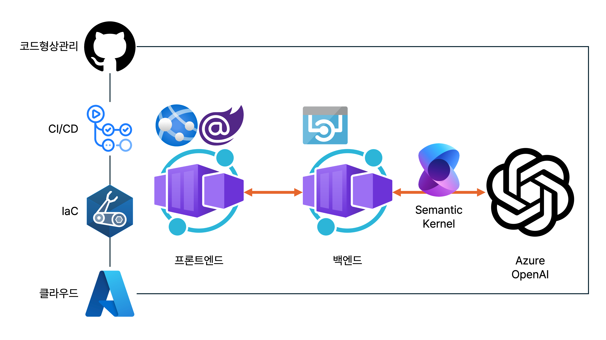

# Capstone Interview Assistant

Azure OpenAI 및 Semantic Kernel을 활용한 인터뷰 코치 앱입니다.

## 시스템 아키텍처



## 애플리케이션 구조

```text
InterviewAssistance
├── src
│   ├── InterviewAssistance.AppHost
│   ├── InterviewAssistance.ServiceDefaults
│   ├── InterviewAssistance.Web
│   ├── InterviewAssistance.ApiService
│   └── InterviewAssistance.Common
└── test
    ├── InterviewAssistance.AppHost.Tests
    ├── InterviewAssistance.Web.Tests
    ├── InterviewAssistance.ApiService.Tests
    └── InterviewAssistance.Common.Tests
```

## 프로젝트 의존성

```text
InterviewAssistance
├── src
│   └── InterviewAssistance.AppHost
│       ├── InterviewAssistance.Web
│       │   ├── InterviewAssistance.ServiceDefaults
│       │   └── InterviewAssistance.Common
│       └── InterviewAssistance.ApiService
│           ├── InterviewAssistance.ServiceDefaults
│           └── InterviewAssistance.Common
└── test
    ├── InterviewAssistance.AppHost.Tests
    │   └── InterviewAssistance.AppHost
    ├── InterviewAssistance.Web.Tests
    │   └── InterviewAssistance.Web
    ├── InterviewAssistance.ApiService.Tests
    │   └── InterviewAssistance.ApiService
    └── InterviewAssistance.Common.Tests
        └── InterviewAssistance.Common
```

## 사전 준비사항

- [.NET SDK 9](https://dotnet.microsoft.com/download/dotnet/9.0) 설치
- [Visual Studio Code](https://code.visualstudio.com/) 설치
- [PowerShell 7](https://learn.microsoft.com/powershell/scripting/install/installing-powershell) 설치
- [git CLI](https://git-scm.com/downloads) 설치
- [GitHub CLI](https://cli.github.com/) 설치
- [Azure CLI](https://learn.microsoft.com/cli/azure/install-azure-cli) 설치
- [Azure Developer CLI](https://learn.microsoft.com/azure/developer/azure-developer-cli/install-azd) 설치
- [Docker Desktop](https://docs.docker.com/get-started/introduction/get-docker-desktop/) 설치

## 시작하기

TBD
